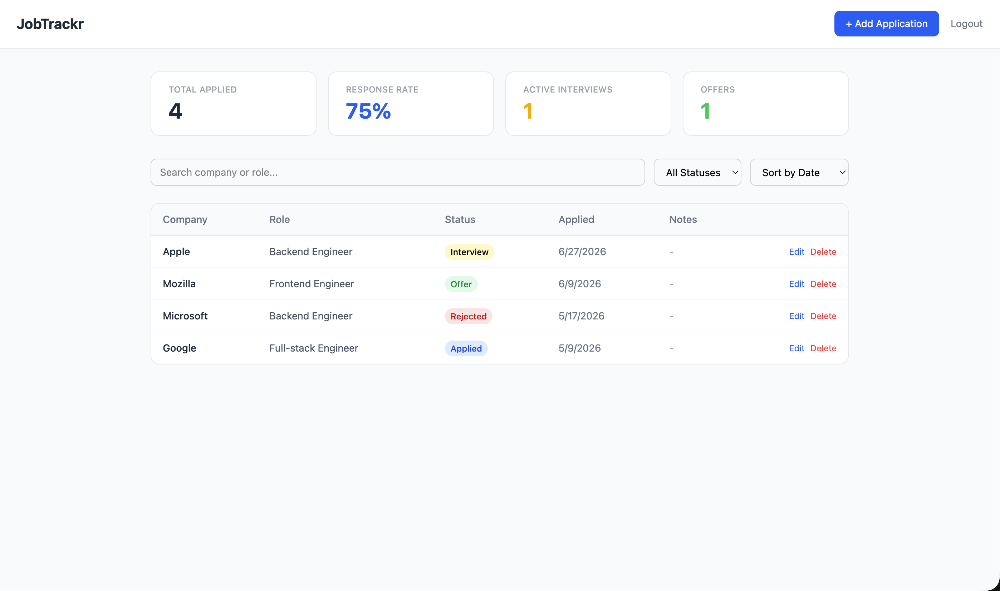
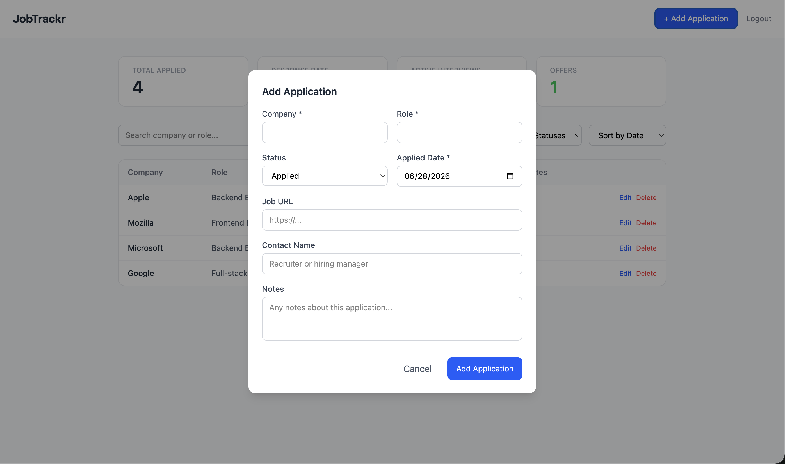
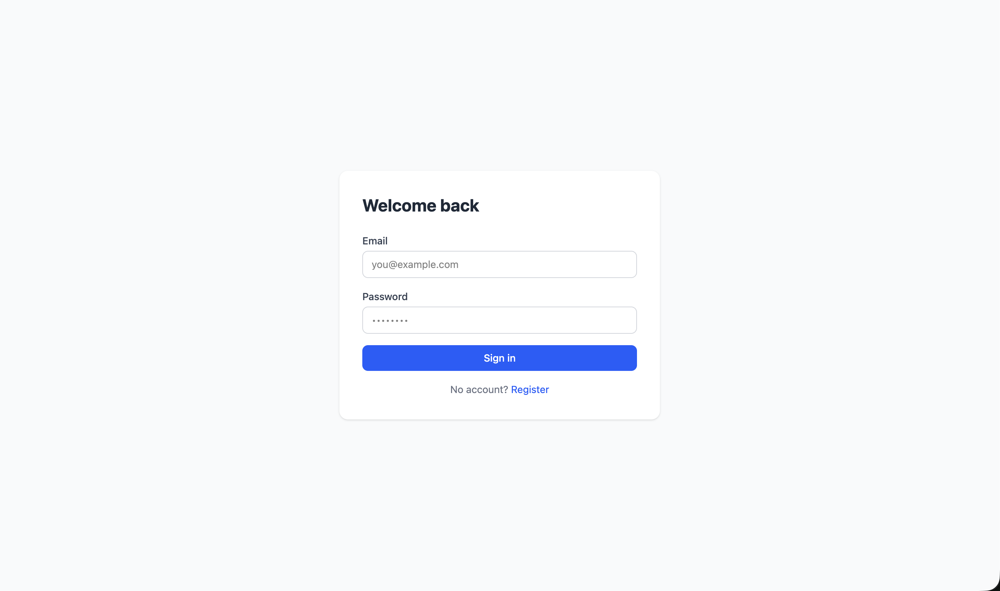

# JobTrackr

A full-stack job application tracker built to manage and monitor every role during a job search. Track applications, update statuses, add notes, and monitor progress through a clean dashboard.


## Features

- **Authentication** — Secure register/login with JWT and bcrypt password hashing
- **Application Tracking** — Add, edit, and delete job applications with full details
- **Status Pipeline** — Track progress through Applied → Interview → Offer → Rejected
- **Stats Bar** — At-a-glance metrics: total applications, response rate, active interviews, and offers
- **Search & Filter** — Filter by status, search by company or role, sort by date or status
- **Notes** — Free-text notes per application
- **Responsive Layout** — Works on desktop and mobile

## Tech Stack

**Frontend**
- React 19 + TypeScript
- Tailwind CSS v4
- React Query (@tanstack/react-query) for server state
- Axios for API calls
- React Router v7
- Vite

**Backend**
- Node.js + Express + TypeScript
- PostgreSQL via Prisma ORM v7
- JWT authentication
- bcryptjs for password hashing

**Infrastructure**
- Frontend: Vercel
- Backend: Render
- Database: Supabase

## Project Structure

```
jobtrackr/
├── client/                 # React frontend
│   └── src/
│       ├── api/            # Axios client
│       ├── components/     # Reusable UI components
│       ├── hooks/          # React Query hooks
│       ├── pages/          # Route-level components
│       └── types/          # Shared TypeScript types
└── server/                 # Express backend
    ├── src/
    │   ├── middleware/     # JWT auth middleware
    │   └── routes/         # API route handlers
    └── prisma/             # Database schema and migrations
```

## Getting Started

### Prerequisites
- Node.js 18+
- PostgreSQL

### Installation

1. **Clone the repo**
```bash
git clone https://github.com/nadielotiene/jobtrackr-app.git
cd jobtrackr
```

2. **Set up the server**
```bash
cd server
npm install
```

Create a `.env` file in `/server`:
```env
DATABASE_URL="postgresql://YOUR_USER@localhost:5432/jobtrackr"
JWT_SECRET="your-secret-key"
PORT=3001
```

Run the database migration:
```bash
npx prisma migrate dev --name init
npx prisma generate
```

Start the server:
```bash
npm run dev
```

3. **Set up the client**
```bash
cd client
npm install
npm run dev
```

4. Open `http://localhost:5173` in your browser

## API Endpoints

| Method | Endpoint               | Description          |Auth |
|--------|------------------------|----------------------|-----|
| POST   | `/api/auth/register`   | Create account       | No  |
| POST   | `/api/auth/login`      | Login                | No  |
| GET    | `/api/applications`    | Get all applications | Yes |
| POST   | `/api/applications`    | Create application   | Yes |
| PUT    | `/api/applications/:id`| Update application   | Yes |
| DELETE | `/api/applications/:id`| Delete application   | Yes |

## Roadmap

- [ ] Kanban board view with drag-and-drop
- [ ] Application timeline chart
- [ ] Export to CSV
- [ ] Follow-up reminders
- [ ] Contact name + LinkedIn URL per application

## Why I Built This
 
I was frustrated with tracking job applications in a spreadsheet — it worked but felt clunky and gave me no visibility into patterns like response rates or how many active interviews I had at once. I decided to build something I'd actually use daily, while also using it as an opportunity to practice building a full-stack TypeScript app.
 
## Technical Decisions
 
**React Query over Redux** — the app's state is almost entirely server data. React Query handles fetching, caching, and invalidation out of the box. Redux would have been overkill.
 
**Prisma ORM** — type-safe database queries that match the TypeScript types on the frontend. The schema-first approach made it easy to reason about the data model before writing any code.
 
**JWT over sessions** — stateless auth fits better for a REST API that will eventually be consumed by a mobile client. No session store needed on the server.
 
**Monorepo structure** — keeping client and server in one repo makes it easier to share types and keep everything in sync during solo development.

## What I Learned
 
- How React Query's `useQuery` and `useMutation` work together — specifically how `invalidateQueries` triggers automatic UI updates after mutations without a page refresh
- Debugging Prisma v7's breaking changes from older versions (config file changes, adapter-based connections, manual `prisma generate`)
- How JWT middleware works in Express and how to extend TypeScript's `Request` type to carry custom properties
- Building reusable components that handle both create and edit states with a single `existing` prop


## Known Limitations
 
- No email verification on register
- No password reset flow yet
- Sessions don't expire on the client when the JWT expires server-side (logout clears it manually)
- Table view only — Kanban board is on the roadmap
## License
 
MIT

## Screenshots

| Home                           | Form                             | Login                            |
|--------------------------------|----------------------------------|----------------------------------|
|  |  |  |

---

## Author

**Kenny** — Full Stack Developer  
[Portfolio](https://my-portfolio-six-jet-80.vercel.app/) · [GitHub](https://github.com/nadielotiene) · [LinkedIn](https://www.linkedin.com/in/kenneth-velazquez-dev/)